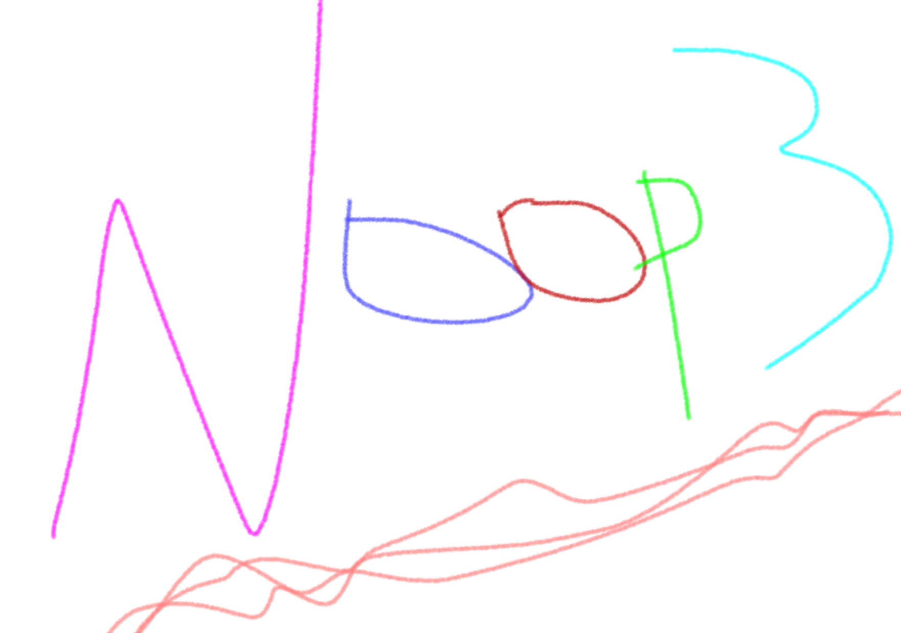

<h1 align="center">
	<br>
	
	<br>
	<br>
	<br>
</h1>

> 🦄 Supreme nothingness

[](https://travis-ci.org/sindresorhus/noop3) [](https://coveralls.io/github/sindresorhus/noop3?branch=master)


## Install

```
$ npm install --save noop3
```


## Usage

```js
const noop = require('noop3');

function unicorn(fn) {
	fn = fn || noop;
	return fn('unicorn');
}
unicorn();

// also compatible with non-mythical single horned creatures
function narwhal(fn) {
	fn = fn || noop;
	return fn('narwhal');
}
narwhal();

// Using the noop factory
const fn = require('noop3/factory');
const rainbow = fn();
const flowers = fn();
rainbow === flowers
//=> false

rainbow()
//=> undefined
```

## Prior art

- [noop2](https://github.com/yoshuawuyts/noop2)


## License

MIT © [Sindre Sorhus](http://sindresorhus.com)
